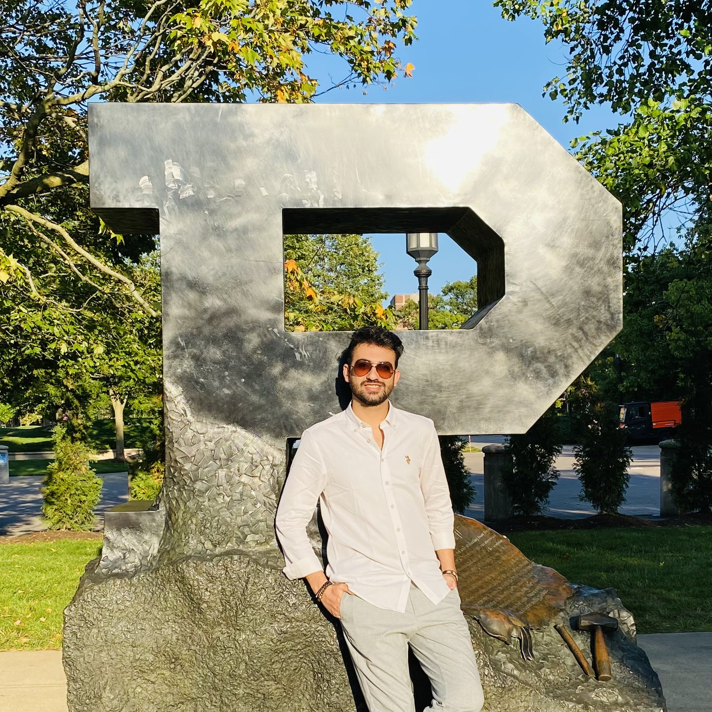

  

 

Thanks for visiting! Here’s a bit about me :)

I’m a second-year PhD student in Mechanical Engineering at <a href="https://engineering.purdue.edu/Herrick" target="_blank" style="color: blue; text-decoration: underline;">Herrick Laboratories</a> at Purdue University, working with <a href="https://kevinjkircher.com/" target="_blank" style="color: blue; text-decoration: underline;">Prof. Kevin Kircher</a>. My research focuses on developing machine learning, optimization, and advanced control algorithms for HVAC systems in residential and commercial buildings. I work on both modeling and field demonstrations, exploring model-based and data-driven approaches to enhance energy efficiency, reduce costs, and improve occupant comfort.

So far, I have conducted an extensive review of over 100 papers on field demonstrations of model predictive control and reinforcement learning in residential and commercial HVAC. I presented a portion of my findings on commercial buildings at the <a href="https://docs.lib.purdue.edu/ihpbc/473/" target="_blank" style="color: blue; text-decoration: underline;">8th International High-Performance Buildings Conference (2024)</a> as well as at the <a href="https://www.youtube.com/watch?v=NJ3izRJVNK0&list=PLcZDMdEnS08kcgUMfKHNHn507XDJG0LGC" target="_blank" style="color: blue; text-decoration: underline;">Intelligent Building Operations (IBO) Workshop 2024</a>. A journal review paper is currently in review process. At Herrick, I have also worked on upgrading the building automation system for real-time monitoring, developing interactive dashboards for energy and comfort feedback, and evaluating traditional model-based control strategies with data-driven ones.

Before my PhD, I earned my MS degree in Mechanical Engineering from the University of British Columbia in Canada, where I worked with <a href="https://scholar.google.com/citations?user=mgUDmT8AAAAJ&hl=en" target="_blank" style="color: blue; text-decoration: underline;">Prof. Sunny Ri Li</a>. My thesis, "<a href="https://open.library.ubc.ca/soa/cIRcle/collections/ubctheses/24/items/1.0437514" target="_blank" style="color: blue; text-decoration: underline;">Mixing gaseous hydrogen into natural gas distribution pipelines</a>," was aligned with the <a href="https://www.canada.ca/en/services/environment/weather/climatechange/climate-plan/net-zero-emissions-2050.html;" target="_blank" style="color: blue; text-decoration: underline;">Canadian Net-Zero Emissions Accountability Act</a>, enshrines in legislation Canada’s commitment to achieve net-zero emissions by 2050. This research led to a <a href="https://doi.org/10.1016/j.ijhydene.2023.11.038" target="_blank" style="color: blue; text-decoration: underline;">journal paper</a> in the International Journal of Hydrogen Energy along with three conference presentations.

I have been recognized with several awards, including the Best Presentation Award at the Canadian Society for Mechanical Engineering (CSME) 2022 Conference and the Best Paper Award at CSME 2023 Conference.

Prior to that, I earned a BS degree in Mechanical Engineering with Honors and Highest Distinction in Iran.

For more details, check out my <b><a href="https://arashjkh.github.io/files/CV_Arash_Jalil_Khabbazi.pdf" target="_blank" style="color: blue; text-decoration:none;">CV</a></b>.

